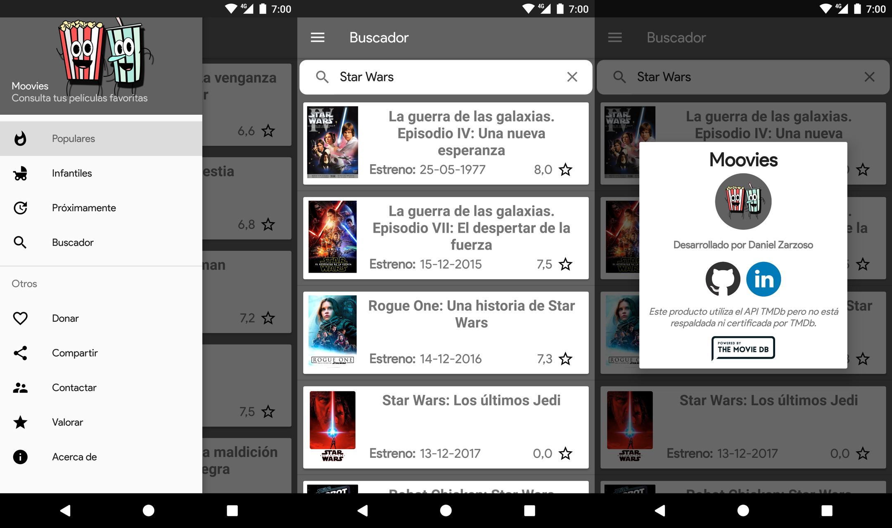
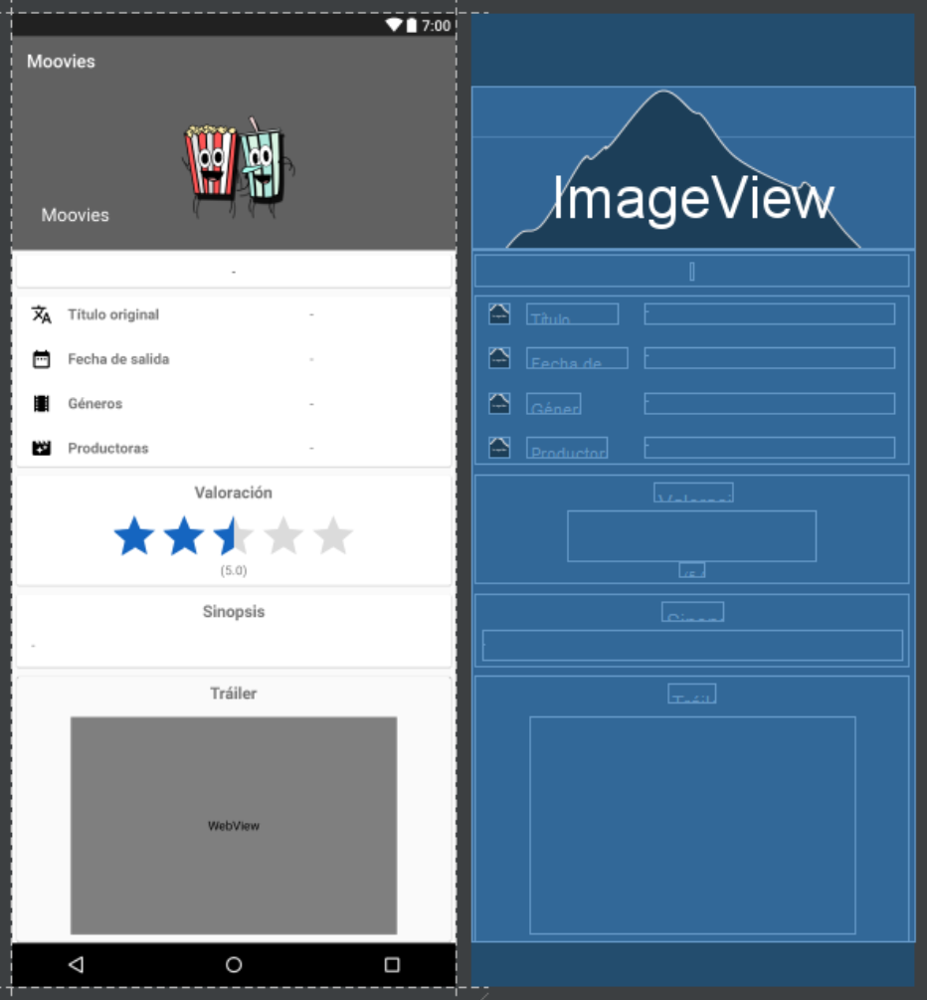
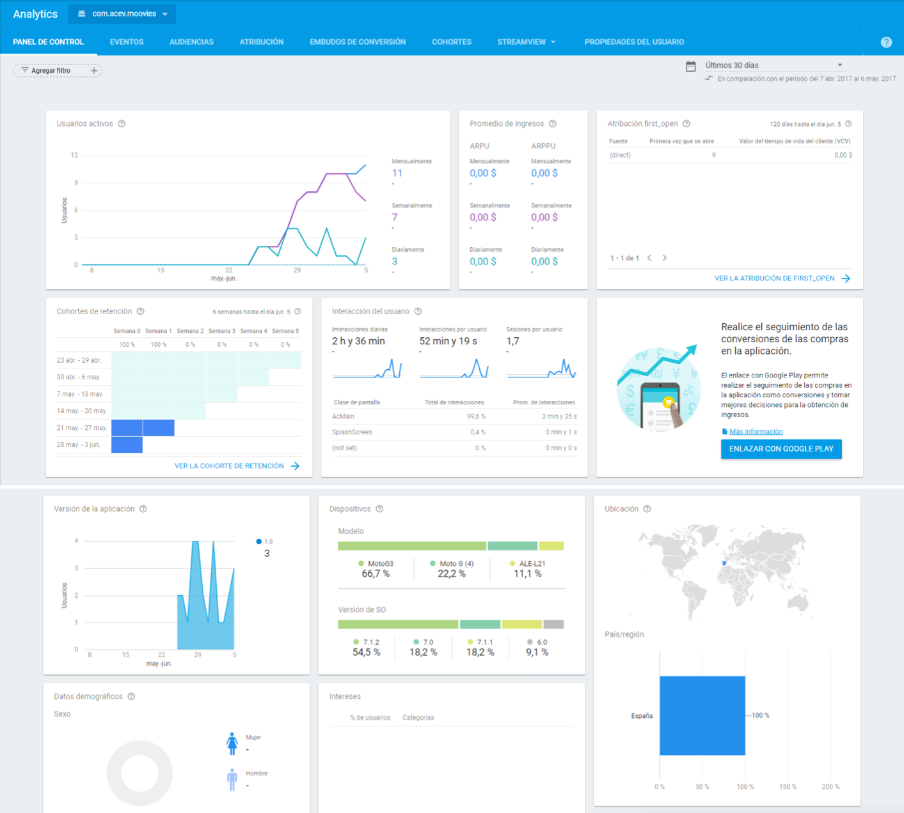
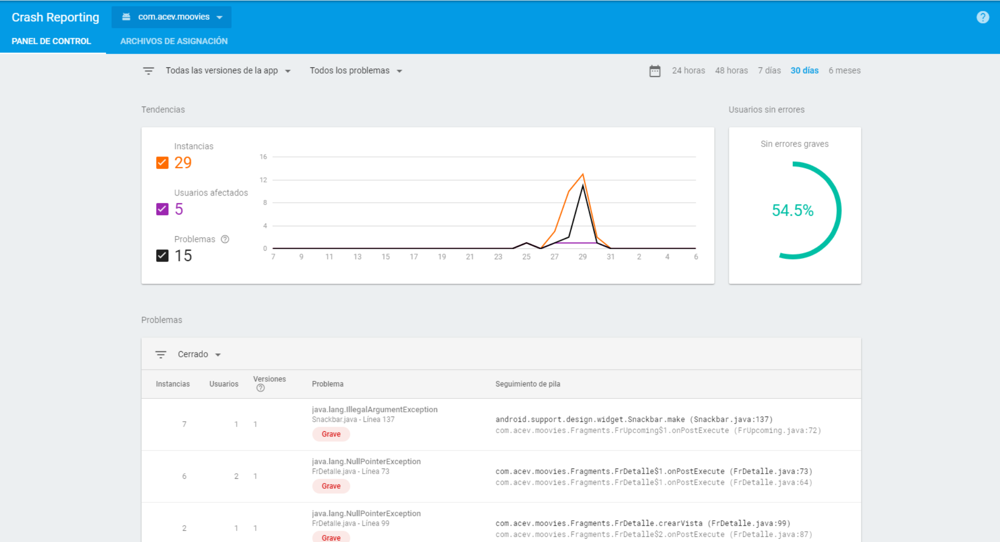
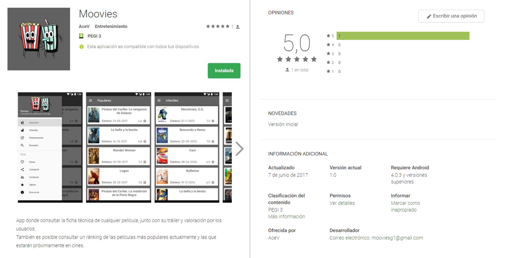

# Moovies

## Tabla de contenido
- [Descripción](#descripción)
- [Tecnologías](#tecnologías)
- [Funcionalidades](#funcionalidades)
- [Despliegue](#despliegue)

 

## Descripción
Proyecto de fin de ciclo (DAM 2016-2017) es la elaboración de una aplicación móvil Android con la funcionalidad de consultar fácilmente los detalles de cualquier película existente, incluyendo próximos lanzamientos, con una interfaz limpia y minimalista.

 

## Funcionalidades

Mediante un menú lateral, es posible desplazarse por cada una de las funciones disponibles de la aplicación.

- Populares: Listado que incluye las películas más populares del momento.
- Infantiles: Listado de películas categorizadas como infantiles ordenadas por popularidad.
- Próximamente: Listado de las películas con fecha de estreno próxima, teniendo en cuenta la fecha actual y ordenadas por popularidad.
- Buscador: Vista con un buscador superior donde introducir título o parte de este de la película que quieres consultar.
- Contactar: Formulario de contacto mediante el que enviar un mensaje para enviar sugerencias o reportar fallos. El mensaje llega mediante un bot de Telegram al administrador.

En los listados de películas es posible pulsar sobre cualquiera de ellas y ver más detalles, como por ejemplo, la sinopsis o un tráiler.

La aplicación cuenta con el SDK de Firebase Analytics en el proyecto, es posible recopilar datos y estadísticas de los usuarios para llevar un mejor seguimiento de la aplicación y la interacción de los terminales donde ha sido instalada.

Otro módulo de Firebase implementado es Crash Reporting. Mediante esta funcionalidad tendremos acceso a un panel con todos los fallos que ocurran en nuestra aplicación.

 

## Tecnologías
La aplicación está desarrollada en Java, lenguaje por defecto para Android en el momento del desarrollo. La organización de interfaces de la aplicación, animaciones, textos, traducciones, etc. se realiza en XML.

Se utilizan las siguientes librerías:
- Picasso: Pequeña librería para cargar imágenes externas a la aplicación en ImageView.

- OkHTTP3: Librería que permite consultas mediante métodos POST en tareas asíncronas a web services.

- AppCompat: Librerías de compatibilidad para que ciertas funciones e interfaces funcionen en versiones antiguas de Android. Entre ellas se han utilizado las de diseño y CardView.

- FontRepacer (sylversky): Utilidad para cambiar la fuente del proyecto fácilmente por una personalizada.

APIs consultadas:

- Telegram: Utilizada para el envío de feedback de la aplicación mediante un bot de Telegram.

- TMDb: Fuente de datos principal de la aplicación.

 

## Despliegue

La aplicación se despliega en Google Play y es compatible con cualquier dispositivo Android 4.0.3+.

Tras la entrega del PFC se retiró.

